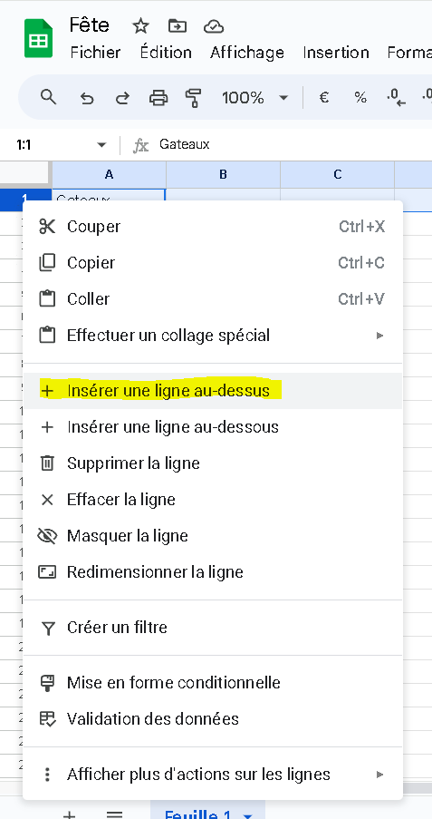
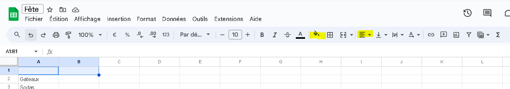
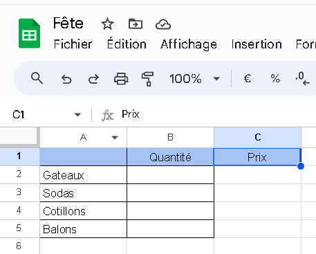
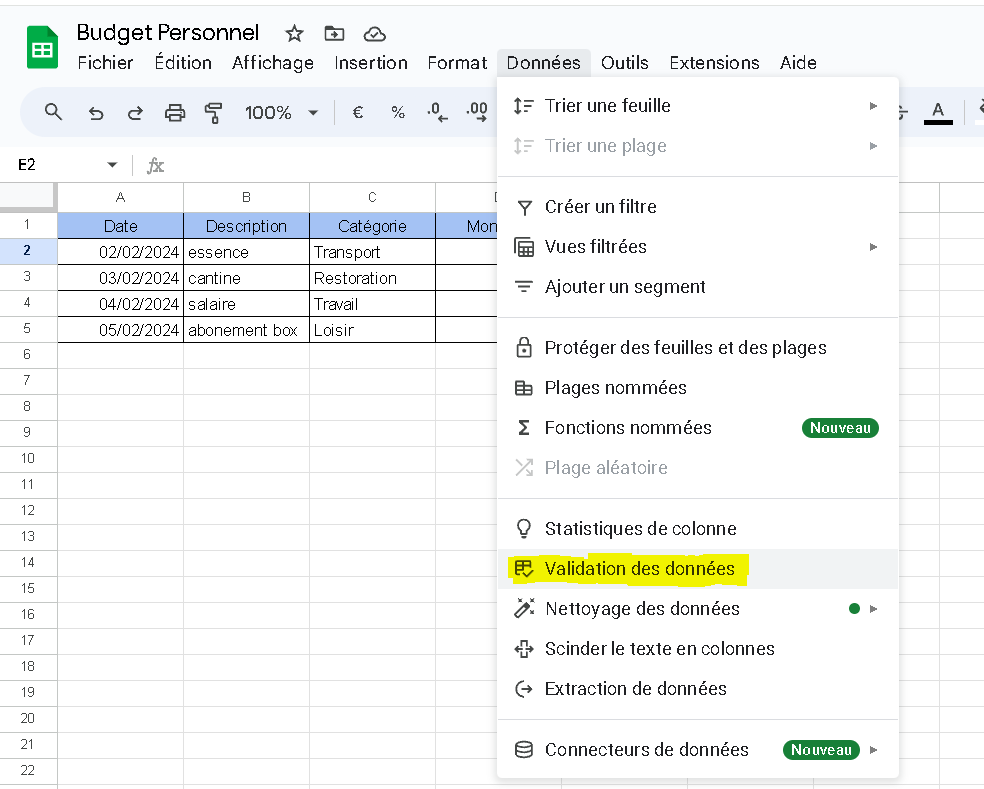
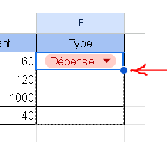

# TP N°1: Découverte de Google Sheets

## Introduction

**Objectif :** Comprendre et utiliser Google Sheets pour créer, gérer et analyser des données dans des feuilles de calcul.

---

## Scénario : Préparation d'une petite fête

### Étape 1 : Préparation de notre feuille Google Sheets

1. Lance Google Sheets et sélectionne "**+ Feuille de calcul vierge**".
2. Clique sur le titre "**Sans titre**" en haut, remplace-le par "**Fête**" et valide avec Entrée.
3. Discutons ensemble des éléments nécessaires à une fête (Exemple : gâteaux, jus, guirlandes).

### Étape 2 : Liste des quantités

1. Dans **la colonne A**, note les noms des éléments pour la fête, un par ligne.
2. Dans **la colonne B**, à côté de chaque élément, indique la quantité voulue.

Maintenant, tu as une liste de courses pour ta fête. Nous allons agrémenter cette liste avec un peu de mise en forme. insert une ligne en dessous de la première ligne en faisant un clic droit sur la première ligne puis en cliquant sur "Insérer une ligne au dessus": 
Sélectionne la première ligne et utilise les options de mise en forme pour changer la couleur de fond et centrer le texte :

Profitons-en pour ajouter une bordure autour de la liste. Sélectionne toutes les cellules de la liste, puis clique sur le bouton "Bordures" dans la barre d'outils et choisis "Toutes les bordures".

### Étape 3 : Prix des articles

1. Sur Internet, recherche le prix moyen de chaque élément pour la fête.
2. Comme nous avons déjà un style pour nos colonnes vosines, nous allons l'appliquer à la colonne C. Sélectionne la colonne C, puis clique sur le bouton "Appliquer le format" dans la barre d'outils, choisis la colonne B comme modèle, puis clique sur la colonne C pour appliquer le style.
   
3. Sur Google Sheets, dans **la colonne C**, écris le prix pour chaque élément déjà listé.
4. Pour calculer le prix total de chaque élément, sélectionne une cellule dans la colonne D à côté de l'élément concerné. Tape "=" puis sélectionne la cellule de la quantité (exemple **B2**), ajoute "\*", puis sélectionne la cellule du prix (exemple **C2**), et valide avec Entrer. Répète pour chaque élément.

### Étape 4 : Calcul du coût total

1. En bas de la colonne D, sélectionne une cellule vide pour le calcul du coût total.
2. Écris "=SOMME(" et sélectionne toutes les cellules au-dessus avec les coûts calculés (exemple **D2:D10**), tape ")", puis valide avec Entrer.
3. Compare le total obtenu avec le budget prévu.

### Étape 5 : Apperçu avant impression

1. Clique sur le menu "**Fichier**" puis "**Aperçu avant impression**".
2. Vérifie que tout est bien aligné et que rien ne dépasse.

## Conclusion

Ce TP a pour but de vous familiariser avec l'utilisation de Google Sheets pour la gestion de projets simples, comme la préparation d'une fête.

---

# TP N°2: Approfondissement avec Google Sheets

## Introduction

**Objectif** : Approfondir les connaissances sur Google Sheets pour analyser des données et gérer efficacement un budget personnel en utilisant des fonctionnalités avancées.

## Scénario : Gestion d'un mini-budget personnel

### Étape 1 : Initialisation du projet

Ouvre Google Sheets et crée une nouvelle feuille en choisissant "+ Feuille de calcul vierge".

Renomme le titre de la feuille en "Budget Personnel" en cliquant sur le titre "Sans titre" en haut.

Nomme les colonnes : Dans A1 tape "Date", en B1 "Description", en C1 "Catégorie", en D1 "Montant", et en E1 "Type".

Pour cela, sélectionne chaque cellule de la première ligne et entre les noms des colonnes. Utilise les options de mise en forme pour centrer le texte et changer la couleur de fond pour distinguer l'en-tête.

### Étape 2 : Saisie des données

Saisis des opérations courantes en utilisant une ligne par opération. Exemple : pour l'achat d'un livre, remplis les colonnes avec la date, la description "Achat livre", la catégorie "Loisirs", le montan.

Pour la colonne "Type", nous allons utiliser une liste déroulante pour différencier les revenus et les dépenses.
Cliques sur la colonne E, va dans Données -> Validation des données, clique sur "Ajouter une règle" et entre dans les options"Revenu" et "Dépense".

Pour que la liste déroulante soit appliquée à toutes les cellules de la colonne E, sélectionne la cellule E2, puis clique sur le coin en bas à droite de la cellule pour étendre la liste déroulante à toutes les cellules de la colonne.

### Étape 3 : Mise en forme conditionnelle

Applique une mise en forme conditionnelle pour différencier visuellement les revenus et les dépenses. Sélectionne la colonne D, puis va dans Format -> Mise en forme conditionnelle.

Crée deux règles : une pour colorer en rouge les cellules où le type est "Dépense" et une autre pour colorer en vert celles où le type est "Revenu".

### Étape 4 : Calcul du solde

Trouve une cellule libre en bas de la colonne "Montant" pour écrire "Solde Total :".

Calcule le solde de ton budget en utilisant la formule =SOMME.SI(E:E,"Revenu",D:D)-SOMME.SI(E:E,"Dépense",D:D) dans la cellule à côté.

### Étape 5 : Création d'un graphique

Sélectionne tes données pour visualiser l'évolution de ton budget sur le mois, incluant les dates et les montants.

Crée un graphique en allant dans Insertion -> Graphique. Choisis le type de graphique "Courbes" pour une représentation claire de ton solde au fil du temps.

## Conclusion

Ce TP a pour but de te donner une compréhension avancée de la gestion d'un budget personnel sur Google Sheets, en t'appuyant sur des fonctionnalités telles que la mise en forme conditionnelle, les formules avancées pour le calcul et l'analyse visuelle des données à travers les graphiques.
